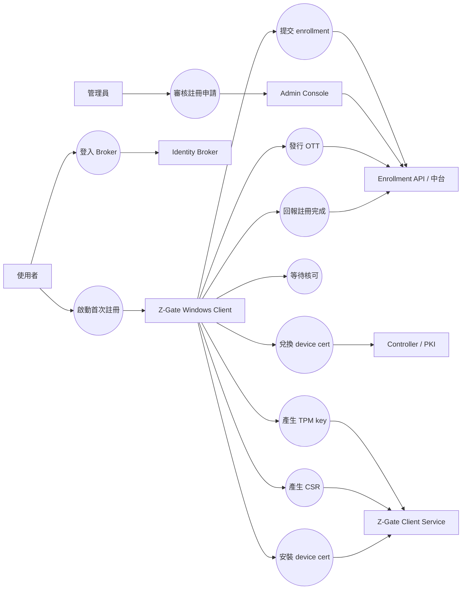
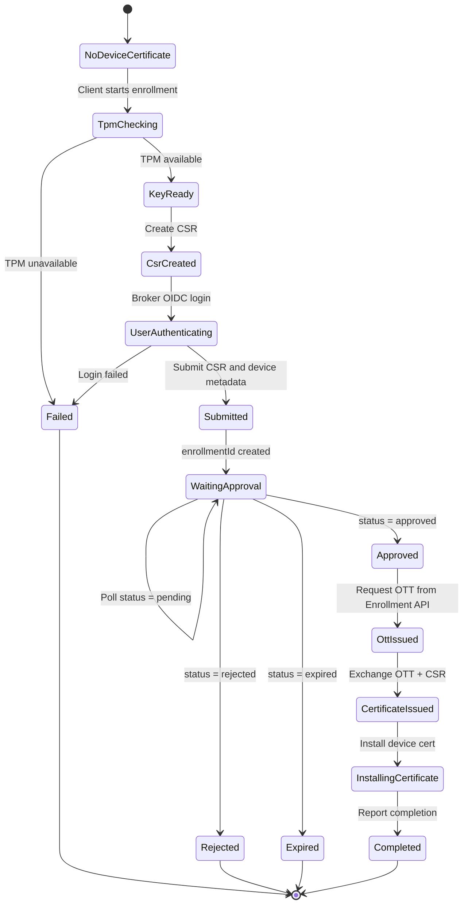
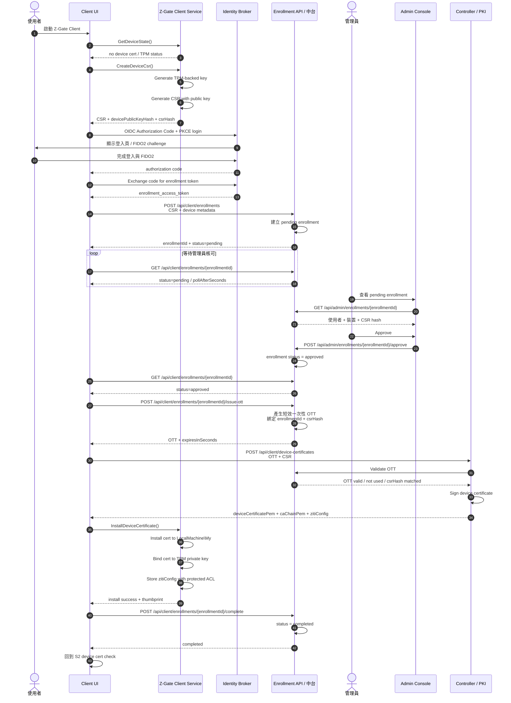

# Z-Gate Windows Client 首次裝置註冊流程 Kickoff 草案

> 文件用途：Kickoff 會議討論用  
> 主題：首次裝置註冊 Enrollment 流程、Use Case、時序圖、API request / response 草案  
> 適用範圍：Z-Gate Windows Client 端與外部 Broker / 中台 / Controller / PKI 對接  
> 日期：2026-07-13

---

## 1. 目標

首次裝置註冊的目標是：

> 讓一台尚未持有 Z-Gate device certificate 的 Windows 裝置，透過 TPM 產生不可匯出的裝置私鑰，送出 CSR 與裝置資訊，經使用者登入與管理員核可後，取得正式 device certificate，成為可信任端點。

本流程只描述 Client 如何與外部系統互動。Identity Broker、中台、Admin Console、Controller、PKI / CA 均為外部系統，不在 Windows Client 專案內實作。

---

## 2. 名詞說明

| 名詞 | 說明 |
| --- | --- |
| Client | Z-Gate Windows Client / Endpoint Agent |
| Service | Z-Gate Client Service，LocalSystem 背景服務，負責 TPM、CSR、cert install 等高權限操作 |
| Broker | Identity Broker，負責使用者登入、OIDC、FIDO2 登入頁 |
| Enrollment API / 中台 | 建立 enrollment、查詢狀態、發行 OTT 的後端服務 |
| Admin Console | 管理員審核裝置註冊申請的管理介面 |
| Controller / PKI | 驗證 OTT 與 CSR，簽發 device certificate 的外部系統 |
| TPM | Trusted Platform Module，可信平台模組，用來保護不可匯出的裝置私鑰 |
| TPM key | 由 TPM 產生並保護的裝置私鑰 / 公鑰對 |
| CSR | Certificate Signing Request，憑證簽發請求，包含 public key 與裝置資訊，不包含 private key |
| device certificate | 裝置憑證，代表此裝置已被核准，後續用於 mTLS / 裝置鑑別 |
| enrollment | 裝置註冊申請 |
| enrollmentId | 中台建立的註冊申請 ID |
| enrollment token | 使用者登入 Broker 後取得、只允許建立註冊申請的短效 token |
| OTT | One-Time Token，一次性權杖，由中台在管理員核可後發行，用於兌換 device certificate |
| devicePublicKeyHash | CSR public key 的 hash，用來讓管理員與後端確認同一把 key |
| CSR hash | CSR 內容的 hash，可用來綁定 OTT，避免 OTT 被拿去搭配別的 CSR |
| cnf | JWT confirmation claim，用於綁定 device cert thumbprint |

---

## 3. 參與角色

| 角色 | 責任 |
| --- | --- |
| 使用者 | 在 Client 中啟動註冊，登入 Broker，等待管理員核可 |
| Client UI | 顯示註冊精靈、Broker login、等待核可、錯誤與完成狀態 |
| Z-Gate Client Service | 產生 TPM key、CSR、安裝 device cert、保存 enrollment local state |
| Broker | 使用 OIDC + PKCE 驗證使用者，必要時要求 FIDO2 |
| Enrollment API / 中台 | 接收 CSR + 裝置資訊，建立 pending enrollment，發行 OTT |
| 管理員 | 在 Admin Console 審核 pending enrollment |
| Controller / PKI | 驗證 OTT + CSR，簽發 device certificate / CA chain / ziti config |

---

## 4. Use Case 圖



---

## 5. 註冊狀態機



---

## 6. 完整時序圖



---

## 7. API 總覽

| # | API | 呼叫方 | 提供方 | 用途 |
| ---: | --- | --- | --- | --- |
| 1 | `GET /.well-known/openid-configuration` | Client | Broker | 取得 OIDC metadata |
| 2 | `GET /protocol/openid-connect/auth` | Client WebView2 | Broker | 使用者登入 / FIDO2 |
| 3 | `POST /protocol/openid-connect/token` | Client | Broker | authorization code 換 enrollment token |
| 4 | `POST /api/client/enrollments` | Client | Enrollment API / 中台 | 提交 CSR + 裝置資訊 |
| 5 | `GET /api/client/enrollments/{enrollmentId}` | Client | Enrollment API / 中台 | 查詢 enrollment 狀態 |
| 6 | `POST /api/client/enrollments/{enrollmentId}/issue-ott` | Client | Enrollment API / 中台 | approved 後請中台發 OTT |
| 7 | `POST /api/client/device-certificates` | Client | Controller / PKI | 使用 OTT + CSR 兌換 device cert |
| 8 | `POST /api/client/enrollments/{enrollmentId}/complete` | Client | Enrollment API / 中台 | 回報憑證安裝完成 |
| 9 | `POST /api/client/enrollments/{enrollmentId}/cancel` | Client | Enrollment API / 中台 | 使用者取消註冊，可選 |
| 10 | `GET /api/admin/enrollments/{enrollmentId}` | Admin Console | Enrollment API / 中台 | 管理員查看申請 |
| 11 | `POST /api/admin/enrollments/{enrollmentId}/approve` | Admin Console | Enrollment API / 中台 | 管理員核准 |
| 12 | `POST /api/admin/enrollments/{enrollmentId}/reject` | Admin Console | Enrollment API / 中台 | 管理員拒絕 |

---

## 8. API 詳細草案

### 8.1 Broker OIDC Discovery

#### Request

```http
GET https://broker.example.com/.well-known/openid-configuration
```

#### Response

```json
{
  "issuer": "https://broker.example.com",
  "authorization_endpoint": "https://broker.example.com/protocol/openid-connect/auth",
  "token_endpoint": "https://broker.example.com/protocol/openid-connect/token",
  "jwks_uri": "https://broker.example.com/protocol/openid-connect/certs",
  "response_types_supported": ["code"],
  "grant_types_supported": ["authorization_code"],
  "code_challenge_methods_supported": ["S256"]
}
```

#### Client 必須確認

| 欄位 | 檢查 |
| --- | --- |
| `issuer` | 必須等於設定的 `BrokerAuthority` |
| `authorization_endpoint` | 必須是 HTTPS |
| `token_endpoint` | 必須是 HTTPS |
| `jwks_uri` | 必須是 HTTPS |
| `code_challenge_methods_supported` | 必須支援 `S256` |

---

### 8.2 OIDC Authorization Request

這不是 JSON API，而是 WebView2 導向 Broker login page 的 URL。

#### Request

```http
GET https://broker.example.com/protocol/openid-connect/auth?
  response_type=code&
  client_id=zgate-windows-client&
  redirect_uri=http%3A%2F%2Flocalhost%3A49152%2Fzgate-callback&
  scope=openid%20profile%20zgate.enrollment&
  state=base64url-random-state&
  nonce=base64url-random-nonce&
  code_challenge=base64url-sha256-code-verifier&
  code_challenge_method=S256
```

#### 重要參數

| 參數 | 說明 |
| --- | --- |
| `response_type` | 固定 `code` |
| `client_id` | Broker 設定的 Z-Gate Client ID |
| `redirect_uri` | 本機 loopback callback，每次使用 random port |
| `scope` | 至少 `openid`，另加 enrollment scope |
| `state` | 防 CSRF，callback 必須比對 |
| `nonce` | 防 token replay，JWT 必須比對 |
| `code_challenge` | PKCE challenge |
| `code_challenge_method` | 固定 `S256` |

#### Callback

```http
GET http://localhost:49152/zgate-callback?code=abc123&state=base64url-random-state
```

---

### 8.3 Token Exchange

#### Request

```http
POST https://broker.example.com/protocol/openid-connect/token
Content-Type: application/x-www-form-urlencoded
```

```text
grant_type=authorization_code&
client_id=zgate-windows-client&
code=abc123&
redirect_uri=http%3A%2F%2Flocalhost%3A49152%2Fzgate-callback&
code_verifier=original-random-code-verifier
```

#### Response

```json
{
  "access_token": "eyJhbGciOiJSUzI1NiIs...",
  "id_token": "eyJhbGciOiJSUzI1NiIs...",
  "token_type": "Bearer",
  "expires_in": 300,
  "scope": "openid profile zgate.enrollment"
}
```

#### Client 用途

| Token | 用途 |
| --- | --- |
| `id_token` | 識別使用者，可用於 UI 顯示與 enrollment owner |
| `access_token` | 呼叫 Enrollment API，作為 `enrollment_access_token` |

---

### 8.4 建立 Enrollment

#### Request

```http
POST https://commander.example.com/api/client/enrollments
Authorization: Bearer <enrollment_access_token>
Content-Type: application/json
Idempotency-Key: 4ef2d2a4-7e68-4d89-9cf6-1f9d7e91f001
```

```json
{
  "csr": "-----BEGIN CERTIFICATE REQUEST-----\nMIIB...snip...\n-----END CERTIFICATE REQUEST-----",
  "csrHash": "sha256:7a9e0b2f...",
  "devicePublicKeyHash": "sha256:abc123...",
  "deviceName": "DESKTOP-001",
  "machineIdHash": "sha256:machine-guid-derived-value",
  "os": {
    "name": "Windows 11",
    "version": "23H2",
    "build": 22631,
    "architecture": "x64"
  },
  "client": {
    "name": "Z-Gate Windows Client",
    "version": "1.0.0"
  },
  "tpm": {
    "present": true,
    "ready": true,
    "provider": "Microsoft Platform Crypto Provider",
    "keyAlgorithm": "ECDSA_P256",
    "keyExportable": false
  },
  "requestedAt": "2026-07-13T10:30:00+08:00",
  "correlationId": "4ef2d2a4-7e68-4d89-9cf6-1f9d7e91f001"
}
```

#### Response: pending

```json
{
  "enrollmentId": "enr_20260713_0001",
  "status": "pending",
  "pollAfterSeconds": 30,
  "expiresAt": "2026-07-16T10:30:00+08:00",
  "message": "Waiting for administrator approval"
}
```

#### 後端需從 token 解析的使用者資訊

後端應從 `Authorization: Bearer <enrollment_access_token>` 解析：

```json
{
  "sub": "user-123",
  "upn": "mike@example.com",
  "displayName": "Mike",
  "groups": ["VPN-Users", "IT"]
}
```

建立 enrollment 時，中台應保存：

| 欄位 | 說明 |
| --- | --- |
| `requestedBySub` | 使用者唯一 ID |
| `requestedByUpn` | 使用者帳號 |
| `csrHash` | CSR hash |
| `devicePublicKeyHash` | device public key hash |
| `status` | 初始 `pending` |
| `expiresAt` | pending 過期時間 |

---

### 8.5 查詢 Enrollment 狀態

#### Request

```http
GET https://commander.example.com/api/client/enrollments/{enrollmentId}
Authorization: Bearer <enrollment_access_token>
```

#### Response: pending

```json
{
  "enrollmentId": "enr_20260713_0001",
  "status": "pending",
  "pollAfterSeconds": 30,
  "updatedAt": "2026-07-13T10:31:00+08:00"
}
```

#### Response: approved

```json
{
  "enrollmentId": "enr_20260713_0001",
  "status": "approved",
  "approvedAt": "2026-07-13T11:00:00+08:00",
  "approvedBy": "admin@example.com",
  "ottIssueUrl": "https://commander.example.com/api/client/enrollments/enr_20260713_0001/issue-ott"
}
```

#### Response: rejected

```json
{
  "enrollmentId": "enr_20260713_0001",
  "status": "rejected",
  "rejectedAt": "2026-07-13T11:00:00+08:00",
  "reasonCode": "DEVICE_NOT_ALLOWED",
  "message": "Device registration request was rejected by administrator"
}
```

#### Response: expired

```json
{
  "enrollmentId": "enr_20260713_0001",
  "status": "expired",
  "expiredAt": "2026-07-16T10:30:00+08:00",
  "message": "Enrollment request expired"
}
```

---

### 8.6 發行 OTT

OTT 由中台產生，Client 只在 enrollment approved 後請求發行。

#### Request

```http
POST https://commander.example.com/api/client/enrollments/{enrollmentId}/issue-ott
Authorization: Bearer <enrollment_access_token>
Content-Type: application/json
```

```json
{
  "csrHash": "sha256:7a9e0b2f...",
  "devicePublicKeyHash": "sha256:abc123...",
  "correlationId": "4ef2d2a4-7e68-4d89-9cf6-1f9d7e91f001"
}
```

#### Response

```json
{
  "enrollmentId": "enr_20260713_0001",
  "status": "approved",
  "ott": "eyJhbGciOiJSUzI1NiIs...",
  "ottType": "jwt",
  "expiresInSeconds": 300,
  "expiresAt": "2026-07-13T11:05:00+08:00",
  "boundClaims": {
    "csrHash": "sha256:7a9e0b2f...",
    "devicePublicKeyHash": "sha256:abc123..."
  }
}
```

#### 安全要求

| 要求 | 說明 |
| --- | --- |
| 一次性 | 使用後立即失效 |
| 短效 | 建議 5-10 分鐘 |
| 綁定 enrollmentId | 只能用於該 enrollment |
| 綁定 CSR hash | 避免 OTT 搭配其他 CSR |
| 不落地 | Client 不寫檔 |
| 不記完整 log | log 只記 hash 或末 6 碼 |

---

### 8.7 兌換 Device Certificate

#### Request

```http
POST https://controller.example.com/api/client/device-certificates
Content-Type: application/json
```

```json
{
  "ott": "eyJhbGciOiJSUzI1NiIs...",
  "csr": "-----BEGIN CERTIFICATE REQUEST-----\nMIIB...snip...\n-----END CERTIFICATE REQUEST-----",
  "csrHash": "sha256:7a9e0b2f...",
  "correlationId": "4ef2d2a4-7e68-4d89-9cf6-1f9d7e91f001"
}
```

#### Controller / PKI 驗證項目

| 驗證 | 說明 |
| --- | --- |
| OTT signature | OTT 是否由中台簽發 |
| OTT expiry | OTT 是否過期 |
| OTT single-use | OTT 是否已用過 |
| enrollment status | enrollment 是否 approved |
| CSR hash | request CSR 是否等於 OTT 綁定的 CSR |
| public key hash | public key 是否等於 enrollment 記錄 |
| device policy | 是否符合裝置政策 |

#### Response

```json
{
  "deviceCertificatePem": "-----BEGIN CERTIFICATE-----\nMIIC...snip...\n-----END CERTIFICATE-----",
  "caChainPem": [
    "-----BEGIN CERTIFICATE-----\nMIIC...root...\n-----END CERTIFICATE-----",
    "-----BEGIN CERTIFICATE-----\nMIIC...intermediate...\n-----END CERTIFICATE-----"
  ],
  "deviceCertThumbprint": "sha256:DEF456...",
  "zitiConfig": {
    "controllerUrl": "https://ziti-controller.example.com",
    "identityName": "DESKTOP-001",
    "externalAuthRequired": true
  },
  "notBefore": "2026-07-13T11:00:00+08:00",
  "notAfter": "2027-07-13T11:00:00+08:00"
}
```

---

### 8.8 回報註冊完成

#### Request

```http
POST https://commander.example.com/api/client/enrollments/{enrollmentId}/complete
Authorization: Bearer <enrollment_access_token>
Content-Type: application/json
```

```json
{
  "deviceCertThumbprint": "sha256:DEF456...",
  "installedAt": "2026-07-13T11:01:00+08:00",
  "clientVersion": "1.0.0",
  "result": "success",
  "correlationId": "4ef2d2a4-7e68-4d89-9cf6-1f9d7e91f001"
}
```

#### Response

```json
{
  "enrollmentId": "enr_20260713_0001",
  "status": "completed",
  "deviceStatus": "active"
}
```

---

### 8.9 取消 Enrollment，可選

#### Request

```http
POST https://commander.example.com/api/client/enrollments/{enrollmentId}/cancel
Authorization: Bearer <enrollment_access_token>
Content-Type: application/json
```

```json
{
  "reason": "user_cancelled",
  "correlationId": "4ef2d2a4-7e68-4d89-9cf6-1f9d7e91f001"
}
```

#### Response

```json
{
  "enrollmentId": "enr_20260713_0001",
  "status": "cancelled"
}
```

---

### 8.10 管理員查看 Enrollment

#### Request

```http
GET https://commander.example.com/api/admin/enrollments/{enrollmentId}
Authorization: Bearer <admin_access_token>
```

#### Response

```json
{
  "enrollmentId": "enr_20260713_0001",
  "status": "pending",
  "requestedBy": {
    "sub": "user-123",
    "upn": "mike@example.com",
    "displayName": "Mike",
    "groups": ["VPN-Users", "IT"]
  },
  "device": {
    "deviceName": "DESKTOP-001",
    "machineIdHash": "sha256:machine-guid-derived-value",
    "devicePublicKeyHash": "sha256:abc123...",
    "csrHash": "sha256:7a9e0b2f..."
  },
  "os": {
    "name": "Windows 11",
    "version": "23H2",
    "build": 22631,
    "architecture": "x64"
  },
  "client": {
    "name": "Z-Gate Windows Client",
    "version": "1.0.0"
  },
  "requestedAt": "2026-07-13T10:30:00+08:00",
  "expiresAt": "2026-07-16T10:30:00+08:00"
}
```

---

### 8.11 管理員核准 Enrollment

#### Request

```http
POST https://commander.example.com/api/admin/enrollments/{enrollmentId}/approve
Authorization: Bearer <admin_access_token>
Content-Type: application/json
```

```json
{
  "comment": "Approved for Mike's corporate laptop",
  "deviceOwnerSub": "user-123",
  "deviceGroupIds": ["grp-zgate-users"],
  "policyProfileId": "policy-standard-windows",
  "correlationId": "admin-action-uuid"
}
```

#### Response

```json
{
  "enrollmentId": "enr_20260713_0001",
  "status": "approved",
  "approvedBy": "admin@example.com",
  "approvedAt": "2026-07-13T11:00:00+08:00"
}
```

---

### 8.12 管理員拒絕 Enrollment

#### Request

```http
POST https://commander.example.com/api/admin/enrollments/{enrollmentId}/reject
Authorization: Bearer <admin_access_token>
Content-Type: application/json
```

```json
{
  "reasonCode": "DEVICE_NOT_ALLOWED",
  "comment": "Device is not in corporate asset inventory",
  "correlationId": "admin-action-uuid"
}
```

#### Response

```json
{
  "enrollmentId": "enr_20260713_0001",
  "status": "rejected",
  "rejectedBy": "admin@example.com",
  "rejectedAt": "2026-07-13T11:00:00+08:00"
}
```

---

## 9. Client 本機資料保存

### 9.1 Pending enrollment local state

Client 可以保存 pending enrollment state，用於關閉後恢復等待狀態。

儲存位置建議：

```text
%ProgramData%\ZGate\Client\state\pending-enrollment.json
```

內容：

```json
{
  "enrollmentId": "enr_20260713_0001",
  "csrHash": "sha256:7a9e0b2f...",
  "devicePublicKeyHash": "sha256:abc123...",
  "createdAt": "2026-07-13T10:30:00+08:00",
  "expiresAt": "2026-07-16T10:30:00+08:00",
  "status": "pending"
}
```

### 9.2 不可保存的資料

| 資料 | 規則 |
| --- | --- |
| TPM private key | 不可匯出，不以檔案保存 |
| OTT | 不落地，只存在記憶體，用完清除 |
| enrollment access token | 不明文落地 |
| Broker JWT / access token | 不明文落地 |
| 使用者密碼 | Client 永不接觸 |

### 9.3 可保存的資料

| 資料 | 位置 |
| --- | --- |
| enrollmentId | ProgramData state |
| csrHash | ProgramData state |
| devicePublicKeyHash | ProgramData state |
| device certificate | Windows LocalMachine certificate store |
| CA chain | Windows certificate store 或受保護 config |
| zitiConfig | ProgramData config，ACL 限制 |

---

## 10. 錯誤與狀態碼建議

### 10.1 Enrollment status

| Status | 說明 |
| --- | --- |
| `pending` | 等待管理員核可 |
| `approved` | 管理員已核可，可請求 OTT |
| `rejected` | 管理員拒絕 |
| `expired` | pending 太久未處理 |
| `cancelled` | 使用者取消 |
| `ott_issued` | OTT 已發行，可選 |
| `completed` | device cert 已簽發並安裝完成 |

### 10.2 Error response 格式

```json
{
  "error": {
    "code": "ENROLLMENT_NOT_APPROVED",
    "message": "Enrollment is not approved",
    "correlationId": "4ef2d2a4-7e68-4d89-9cf6-1f9d7e91f001"
  }
}
```

### 10.3 常見錯誤碼

| Error code | HTTP | 說明 |
| --- | ---: | --- |
| `INVALID_TOKEN` | 401 | enrollment token 無效 |
| `FORBIDDEN` | 403 | 使用者無權註冊 |
| `CSR_INVALID` | 400 | CSR 格式錯誤 |
| `CSR_HASH_MISMATCH` | 400 | CSR hash 不一致 |
| `ENROLLMENT_NOT_FOUND` | 404 | enrollmentId 不存在 |
| `ENROLLMENT_NOT_APPROVED` | 409 | 尚未核可，不能發 OTT |
| `ENROLLMENT_EXPIRED` | 409 | enrollment 已過期 |
| `OTT_EXPIRED` | 409 | OTT 已過期 |
| `OTT_ALREADY_USED` | 409 | OTT 已使用 |
| `DEVICE_POLICY_DENIED` | 403 | 裝置政策不允許 |

---

## 11. Kickoff 會議待確認事項

| 編號 | 待確認項 | 建議結論 |
| --- | --- | --- |
| K1 | Enrollment API 是中台提供，還是 Broker 提供 | 建議由中台 / Commander 提供 |
| K2 | Client 建立 enrollment 前是否必須登入 Broker | 建議必須 |
| K3 | enrollment token scope 名稱 | 建議 `zgate.enrollment` |
| K4 | 管理員核可後是否立即發 OTT | 建議不要，Client approved 後再請求 `issue-ott` |
| K5 | OTT 格式 | JWT 或 opaque token 皆可，需可驗簽 / 驗有效性 |
| K6 | OTT 是否綁定 CSR hash | 建議必須 |
| K7 | pending enrollment 有效期 | 建議 24-72 小時 |
| K8 | OTT 有效期 | 建議 5-10 分鐘 |
| K9 | Client polling 間隔 | 後端回 `pollAfterSeconds` |
| K10 | device metadata 欄位 | Kickoff 凍結最小欄位 |
| K11 | Admin Console 顯示哪些欄位 | 使用者、裝置名、OS、public key hash、CSR hash |
| K12 | Controller / PKI 如何驗 OTT | 由中台提供 JWKS 或 introspection API |
| K13 | device cert EKU / SAN 格式 | 需 PKI 團隊確認 |
| K14 | 註冊完成後是否回報中台 | 建議 Client 呼叫 `/complete` |
| K15 | rejected / expired 後是否允許重新申請 | 建議允許新 enrollment |

---

## 12. 會議簡短版流程

```text
1. Client 發現沒有 device cert。
2. Service 用 TPM 產生不可匯出的 private key。
3. Service 用 public key 產生 CSR。
4. 使用者透過 Broker OIDC + FIDO2 登入。
5. Client 用 enrollment token 把 CSR + 裝置資訊送中台。
6. 中台建立 pending enrollment，回 enrollmentId。
7. 管理員在 Admin Console 核准或拒絕。
8. Client polling 查到 approved。
9. Client 向中台請求發行 OTT。
10. 中台發短效一次性 OTT，綁定 enrollmentId + CSR hash。
11. Client 用 OTT + CSR 向 Controller / PKI 換 device cert。
12. Service 安裝 device cert 到 Windows LocalMachine certificate store。
13. Client 回報 enrollment completed。
14. 後續啟動時，Client 用 device cert + TPM private key 作裝置鑑別。
```
